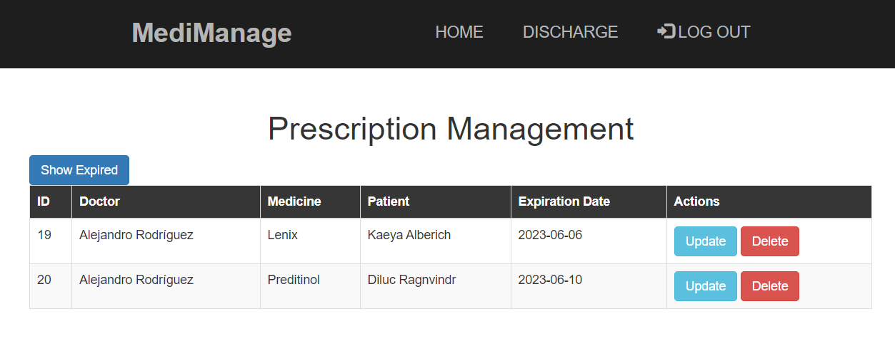

# MediManage

**Table of contents**

- [MediManage](#medimanage)
  - [Introduction](#introduction)
    - [Database Schema](#database-schema)
    - [UML Diagram](#uml-diagram)
  - [How to install](#how-to-install)
  - [How to use](#how-to-use)
    - [Home](#home)
    - [Login](#login)
    - [Sign up](#sign-up)
    - [Prescriptions Management](#prescriptions-management)
    - [Discharge](#discharge)
  - [Testing](#testing)

## Introduction

This is a project proposed by our teacher for the assignature of Development Enviroments (*Entornos de Desarrollo*). Our task was to create a Java backend and frontend with methods for POST and GET requests to get and create data in a database, showing a list of the medical prescriptions in the database and being able to add a new one, plus create the logic for a login feature.   

To achieve this, I decided to use Spring Boot to create an API REST to make HTTP petitions (POST, GET, PUT, and DELETE) to every entity (table) of the database, Thymeleaf to interact with the data received from the backend, JQuery to send HTTP petitions to the backend, MySQL for the database, and Docker to make the application portable.   

I ended up adding more features that the ones initially asked for, as I felt it was the minimum a web application should have and be able to do. I also intend to keep adding more features if I have the time, such as webpages to manage the `Medicines` and `Patients` entities, another to edit the user account as `Doctors` entity when logged in, or an option to see the medical prescriptions whose expiration date have not expired yet, among others.   

### Database Schema

There are four tables in the database `pharmacy`.


There are six attributes in the table `Doctors`:
- **`id` (int):** Doctor's ID.
- **`email` (String):** Doctor's email.
- **`password` (String):** Doctor's password.
- **`name` (String):** Doctor's name.
- **`lastLog` (LocalDate):** Doctor's last log in their account.
- **`session` (Integer):** Session number from the Doctor's current logged account. If it's not logged in, it will be null.


There are three attributes in the table `Medicines`:
- **`id` (int):** Medicine's ID.
- **`name` (String):** Medicine's name.
- **`tmax` (float):** Maximum temperature supported by the medicine.
- **`tmin` (float):** Minimum temperature supported by the medicine.


There are three attributes in the table `Patients`:
- **`id` (int):** Patient's ID.
- **`email` (String):** Patient's email.
- **`name` (String):** Patient's name.


There are three attributes in the table `Prescriptions`:
- **`id` (int):** Prescription's ID.
- **`id_doctor` (Doctors):** Doctor's ID associated with the prescription.
- **`id_medicine` (Medicines):** Medicine's ID associated with the prescription.
- **`id_patient` (Patients):** Patient's ID associated with the prescription.
- **`date` (LocalDate):** Expiration date of the prescription.


### UML Diagram

- **`main/java/edu/craptocraft/medimanage`**
  - **`App`:** Main app to execute the application.
  - **`controller`:** Controllers and endpoints of the API REST.
  - **`entity`:** Entities used to create the database's tables, plus another not-entity class.
  - **`repository`:** Repositories to access the methods of `CrudRepository`.
  - **`service`:** Interfaces of the methods used by the controllers.
    - **`implementation`:** Implementation of the methods of the interfaces.
- **`main/resources`**
  - **`static`:** CSS and images for the frontend.
  - **`templates`:** HTML webpages.
- **`test`:** Test cases for the application's backend.


## How to install

You will need to have already installed: `Git`, and `Docker`.   

1. First, open the terminal and go to the folder in which you desire to clone the repository. When you're inside, clone the repository:

    ```
    git clone https://github.com/ncocana/medimanage.git
    ```

2. Open the terminal and run the Docker compose file using the following command:

    ```
    docker-compose up
    ```

     

    This will create the needed containers (one for the MySQL database, and another for the application automatically building before a Docker image using the existing Dockerfile) and a network for the containers to connect with each other.   

    Upon executing the application for the first time, it will also populate it with some mock data. If this is something you don't want, you can go to the `App.java` file and comment the `run(String... args)` function along with the service attributes in the code. This will create instead an empty database, so you will have to create the desired data yourself (if an error happens when creating an empty database, you will need to go to the `src/main/resources/application.properties` file and change `spring.jpa.hibernate.ddl-auto` to `create` and then to `update` again after the first execution).   

    You will know the containers are fully and already created when you see a log saying `Started App` along with some logs of inserted data if you haven't the `run(String... args)` function from the `App.java` file:   

     

    To stop the containers, pulse Ctrl + C. Then you can delete the containers and its network with:

    ```
    docker-compose down
    ```

    Additionally, if you don't want to see the container's logs, you can run the Docker compose file in the background of the terminal with: `docker-compose up -d` (though I won't recommend it as the containers take some time to be fully started and seeing the logs could help you knowing when it's finished). The proccess to delete the containers and its network is the same as above.   

    You can view the container created with the command: `docker ps -a` (this will show you all the containers, running or not. To view only the ones running at the moment: `docker ps`).

    You can view the image created with the command: `docker images`.

    To remove the image, get its ID or name with the command from above and do this command: `docker rmi <image's ID or name>`. Using a random ID as example, the command would be as follow: `docker rmi ac6d8c993fa7`.

    You can enter the container with: `docker exec -it medimanage bash`.

## How to use

Enter to the following link to see the webpage of the application: [http://127.0.0.1:8080/](http://127.0.0.1:8080/)

### Home

This is the homepage and index from where you can log in the application.   


### Login

You will need to enter an already existing email and password from one of the Doctor entries in the Doctors table. You can use one of the Doctor accounts already created uppon executing the app for the first time, or choose the sign up option to create a new Doctor account.   


### Sign up

You will be asked to enter your full name, email address, and a password. Once you hit the sign up button, your account will be automatically created and you'll be able to sign in the application with it.   


### Prescriptions Management

This is the homepage you'll see once signed in. You can see a list with the data from the `Prescriptions` table, along with a column with two buttons to update or delete the entry.   

The data you see will be the one associated with your Doctor account. You wouldn't be able to see the prescriptions associated to another doctors.   




### Discharge

Here you can create new prescriptions entries using the data of the other tables.   


## Testing

To run the tests, you will need to run the `docker-compose up` command to start the containers and then enter inside the app container with this command:   

```
docker exec -it medimanage bash
```

Once inside, the only thing you need to do is run the maven command to start the tests:   

```
mvn test
```

This will run all the tests cases created and output if they were successful or not.   


